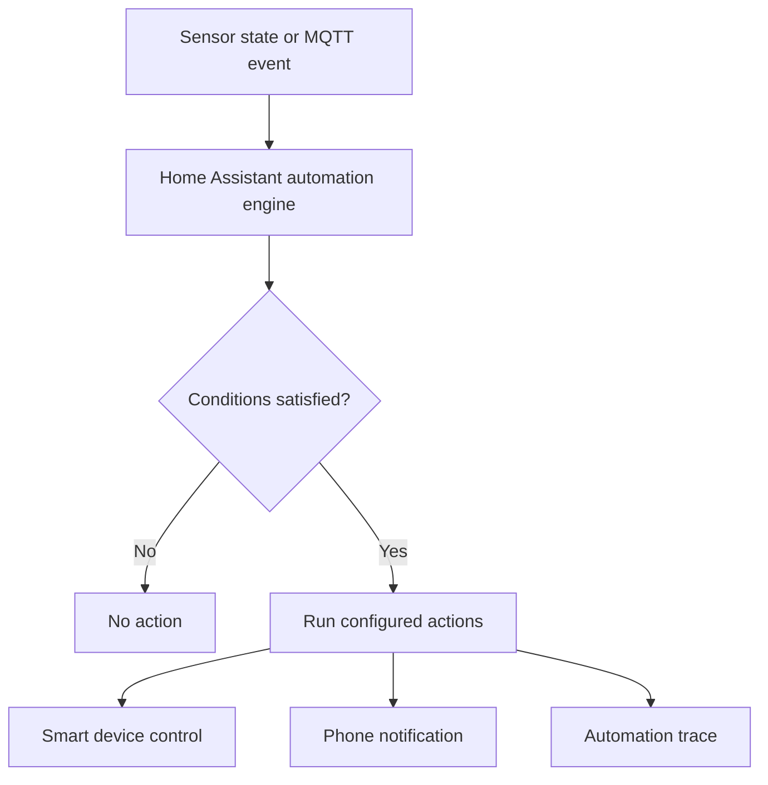

# Automation Overview

```mermaid
flowchart TD
    Inputs[Sensor state or MQTT event] --> HA[Home Assistant automation engine]
    HA --> Conditions{Conditions satisfied?}
    Conditions -- No --> Stop[No action]
    Conditions -- Yes --> Actions[Run configured actions]
    Actions --> Output1[Smart device control]
    Actions --> Output2[Phone notification]
    Actions --> Trace[Automation trace]
```

## Purpose

Home Assistant evaluates triggers and conditions before performing actions. Traces provide evidence of which branch of an automation executed.