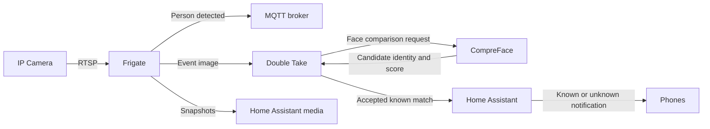

# Camera AI Flow

```mermaid
flowchart LR
    Camera[IP Camera] -->|RTSP| Frigate[Frigate]
    Frigate -->|Person detected| MQTT[MQTT broker]
    Frigate -->|Event image| DT[Double Take]
    DT -->|Face comparison request| CF[CompreFace]
    CF -->|Candidate identity and score| DT
    DT -->|Accepted known match| HA[Home Assistant]
    HA -->|Known or unknown notification| Phones[Phones]
    Frigate -->|Snapshots| Media[Home Assistant media]
```

## Design reason

Person detection occurs before face recognition. This avoids trying to perform facial analysis on every frame of the camera stream.