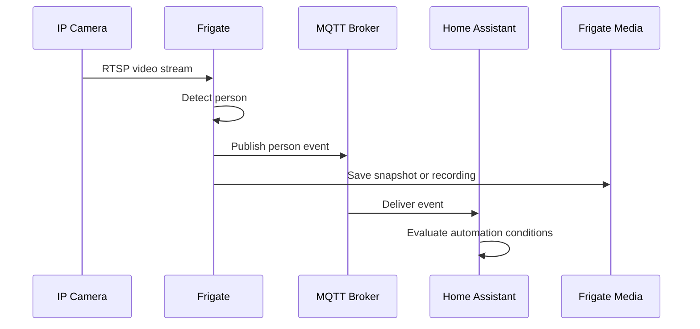

# Frigate Person-Event Flow

```mermaid
sequenceDiagram
    participant Camera as IP Camera
    participant Frigate
    participant MQTT as MQTT Broker
    participant HA as Home Assistant
    participant Media as Frigate Media

    Camera->>Frigate: RTSP video stream
    Frigate->>Frigate: Detect person
    Frigate->>MQTT: Publish person event
    Frigate->>Media: Save snapshot or recording
    MQTT->>HA: Deliver event
    HA->>HA: Evaluate automation conditions
```

## Purpose

Frigate reduces the continuous video stream into person-detection events that can be used by Home Assistant and Double Take.